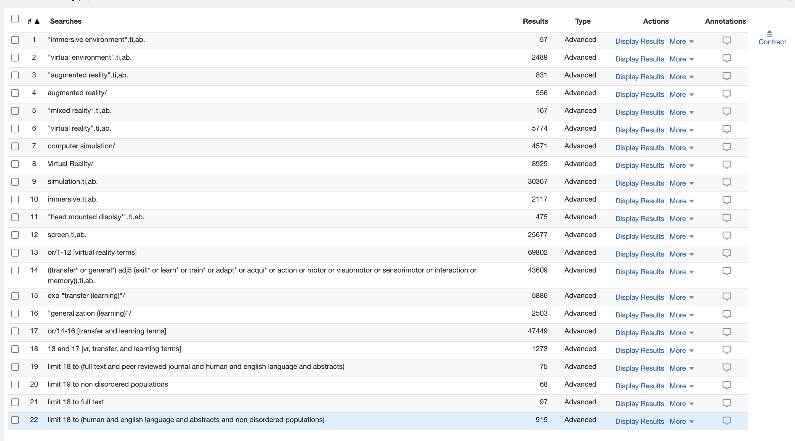

# PsychInfo

## Progress
- [x] execute search in database
- [x] limit search within database
- [x] download results
- [x] duplicate file for filtering
- [ ] create filters
- [ ] update papercounts
- [ ] screen titles
- [ ] screen abstracts
- [ ] sort filtered results

## Results

| Search   |     Results   |
|----------|:-------------:|
| vr terms | 69,802 |
| transfer and learning terms | 47,449 |
| vr, transfer, and learning terms | 1,273  |
| human and english language and abstracts and non disordered populations | 915 |
| filter applied | 110 |
| titles screened |  |
| abstracts screened |  |

## Search strategy

#### Search Terms

"augmented reality".ti,ab.
"mixed reality".ti,ab.
"virtual reality".ti,ab.
immersive.ti,ab.
"immersive reality".ti,ab.
"immersive environment".ti,ab.
"virtual environment".ti,ab.
"head mounted display*".ti,ab.
screen.ti,ab.
augmented reality/
Virtual Reality/
computer simulation/

((transfer* or general*) adj5 (skill* or learn* or train* or adapt* or acqui* or action or motor or visuomotor or sensorimotor or interaction or memory)).ti,ab.

### Exclusion Criteria

#### Limit to
- human and english language and abstracts and non disordered populations

#### Filter
'=IF(<cell>="","",IF(SUMPRODUCT(--(NOT(ISERR(SEARCH({"immersive","immersion","hmd","HMD","head mounted display","VR","rift","vive","virtual reality","headset"},<cell>)))))>0,"Keep","Not relevant"))

